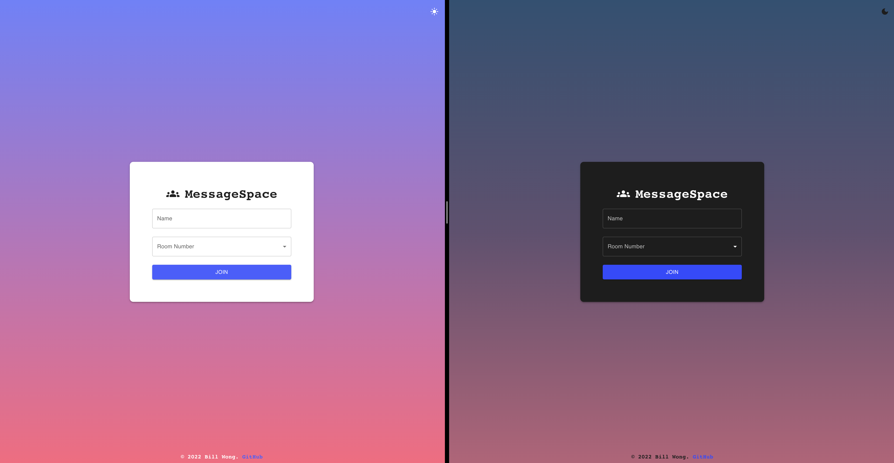
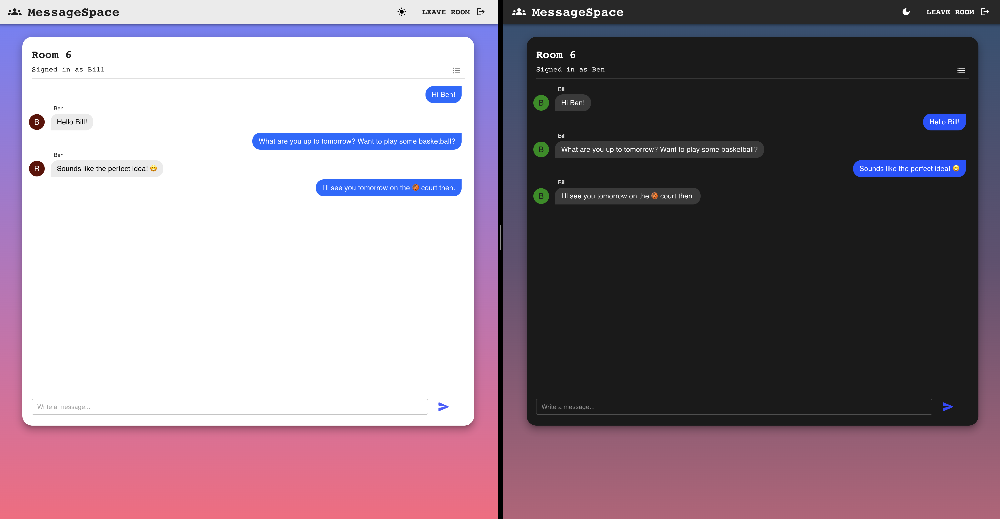
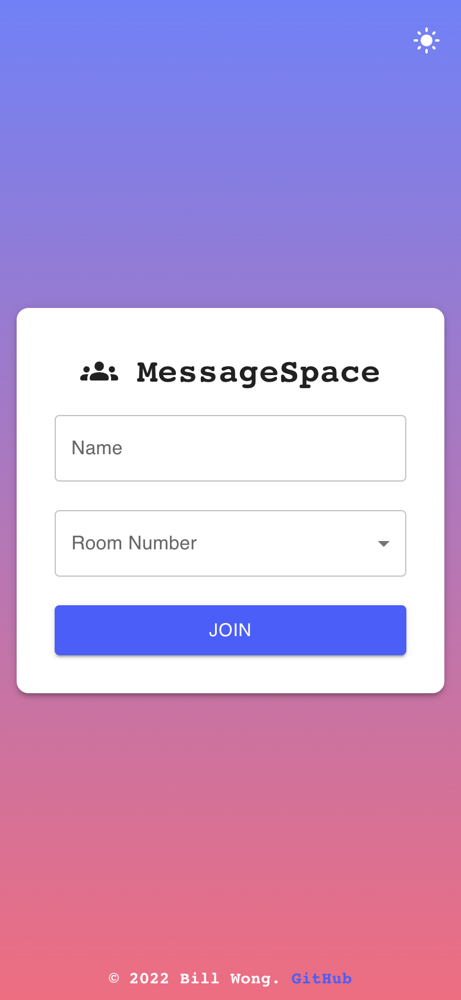
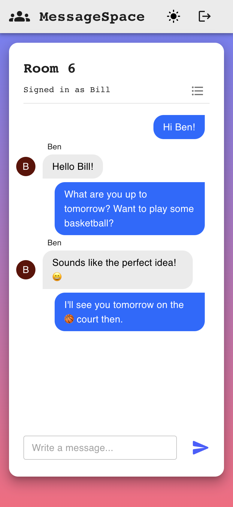
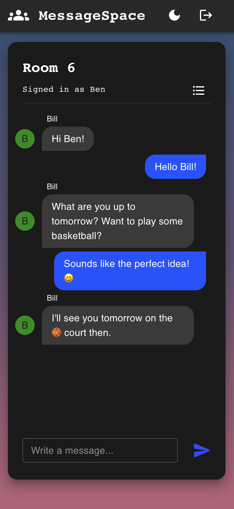

# **MessageSpace** - [_Link here_](https://ui-calculate.web.app)

### I decided to create this project to gain experience with full stack development after making some frontend projects previously. 

> ### Here are some of the things that I learnt in this project:
>
> - Express.js and Socket.io as the backend of the chat app. I used Socket.io to set up bi-directional communication between the client and the server for messaging, where they would maintain a connection and communicate by emitting events.
> - Experimented with a few different methods of backend deployment, such as Azure Container Instances, Azure App Service, and configuration of an Nginx server on an Azure VM instance.
> - At the end, deployed the Node.js server to Azure App Service, as it is a Platform as a Service (PaaS) and the underlying infrastructure, such as hardware, operation systems, load balancing is managed by Azure for better convenience and efficiency.
> - Docker files and docker-compose to containerise and run the full stack app across all platforms easily with minimum configuration.
> - React routes, context, and hooks to manage app state.
> - More experience with integrating Material UI components to create an attractive UI.

### Desktop Preview:

 

### Mobile Preview:

 
    
    
    

